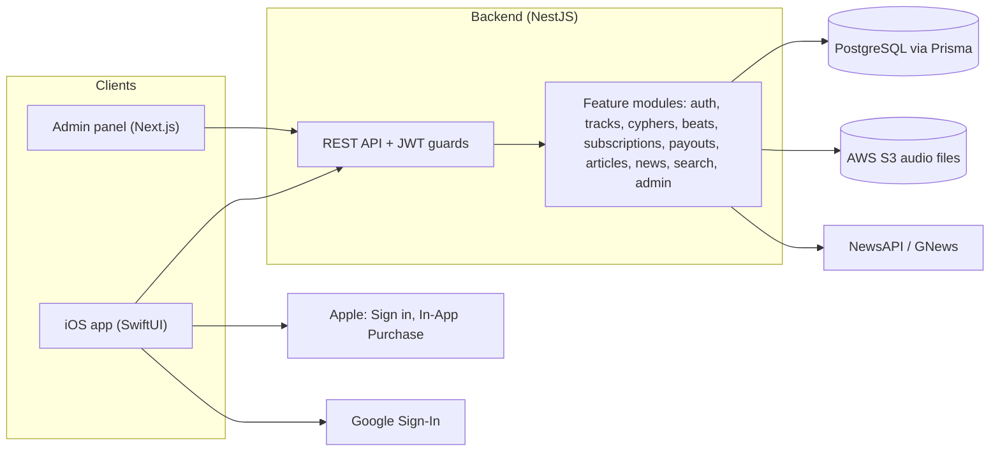

# Cypher (C705)

> **Connect, Compete & Discover in Hip-Hop's Ultimate Ecosystem.**

Cypher is a mobile platform for hip-hop: a place where **artists** share freestyles and songs, **producers** sell beats, **engineers** offer their craft, **journalists** cover the culture, and **fans** discover, vote, and follow, all organized around **cities** and **competition**. Its heart is the **Freestyle Arena**: community "cyphers" where artists post bars over a beat and the community rates them.

The project is an iOS app (SwiftUI) backed by a NestJS API, a PostgreSQL database, and a Next.js admin panel. In the code the app is named **C705**; "Cypher" is the product name used in this repository.

> **Where this document comes from.** This README was written by reading the code, database schema, and existing notes in the repository. It separates **what is built** from **what is partly built** and **what is only planned**. Anything described as a "direction" or "possibility" is a proposal, not a commitment. Where something could not be verified, it says so.

---

## Table of contents

1. [What the app is for](#1-what-the-app-is-for)
2. [Who it serves](#2-who-it-serves)
3. [Features: built, partial, planned](#3-features-built-partial-planned)
4. [What is going well](#4-what-is-going-well)
5. [Concerns and how to fix them](#5-concerns-and-how-to-fix-them)
6. [Tech stack and why it fits](#6-tech-stack-and-why-it-fits)
7. [Architecture](#7-architecture)
8. [Data model at a glance](#8-data-model-at-a-glance)
9. [Getting started](#9-getting-started)
10. [Where the project is, where it is going, and where it could go](#10-where-the-project-is-where-it-is-going-and-where-it-could-go)
11. [Design system](#11-design-system)
12. [Working in this repository](#12-working-in-this-repository)
13. [Documentation index](#13-documentation-index)

---

## 1. What the app is for

Hip-hop is a culture built on **showing up and proving yourself**: the cypher, the battle, the freestyle, the beat tape. The tools most artists use to do that are scattered: SoundCloud for tracks, Instagram for clips, group chats for collaborations, marketplaces for beats, blogs for news. None of them are built around the *competition* and the *city*.

Based on what has been coded so far, Cypher aims to bring that into one place:

- **Prove it:** post a freestyle into a cypher over a locked beat, get rated by the community on *bars*, *flow*, and *creativity*, and climb a leaderboard.
- **Get found:** a profile with your city, bio, tracks, and social links; discover artists by city.
- **Make money from the craft:** producers upload beats with a 20-30 second preview and sell the full file through in-app purchase; earnings and payouts are tracked.
- **Stay informed:** hip-hop news (aggregated from news APIs) and original articles from vetted journalists.
- **Build a community:** follow artists, like and comment on tracks, invite people to cyphers.

The one-line promise from the design mockup is the best summary: **Connect, Compete & Discover.**

## 2. Who it serves

The database defines five roles, each with its own needs:

| Role | What they do in the app |
|---|---|
| **Artist** | Upload tracks and freestyles, host and enter cyphers, build a profile, get followed |
| **Producer** | Upload and sell beats, set prices, track earnings and payouts |
| **Engineer** | Role exists in the data model; the "Engineer Hub" (hire an engineer) in the mockup is **not built yet** |
| **Journalist** | Write articles; accounts are created only with an admin-issued **invite code** |
| **Admin** | Manage users, articles, journalists, cyphers, reports, and settings through the admin panel |

Fans and listeners participate by voting, liking, commenting, and following.

---

## 3. Features: built, partial, planned

Legend: ✅ built (code exists in app and backend) · 🟡 partial / needs verification · 🔲 planned (appears in the mockup or schema only)

### Accounts and identity
| Feature | Status | Notes |
|---|---|---|
| Email + password sign-up and login | ✅ | Passwords hashed with bcrypt; JWT sessions |
| Sign in with Apple | ✅ | Apple expects an equivalent privacy-preserving login option when an app offers other social sign-ins |
| Sign in with Google | ✅ | Via the GoogleSignIn SDK |
| Role selection (Artist / Producer / Engineer / Journalist) | ✅ | |
| Secure token storage on device | ✅ | Stored in the iOS Keychain |
| Journalist accounts via admin invite code | ✅ | One-time codes with optional expiry |
| Username, bio, city, avatar, social links (Instagram, YouTube, X, TikTok) | ✅ | |

### Freestyle Arena (cyphers)
| Feature | Status | Notes |
|---|---|---|
| Create a cypher: open, competitive, or beat-locked | ✅ | Public or invite-only; start/end dates |
| Record or upload an entry into a cypher | ✅ | One entry per artist per cypher |
| Community voting on **bars / flow / creativity** (1-5 each) | ✅ / 🟡 | Built; see the score-storage concern in [section 5](#5-concerns-and-how-to-fix-them) |
| Per-cypher leaderboard | ✅ | |
| "Top cyphers" by week | ✅ | Ranking by entries, votes, and unique artists |
| Invite artists to a cypher; accept / decline | ✅ | |
| Report an entry | ✅ | Feeds the admin reports page |
| "App picks the beat for battles", ranking by city/week/theme (from mockup) | 🔲 | Planned |
| "Feats of the Week" head-to-head banner (from mockup) | 🔲 | Planned; currently a design concept |

### Beats marketplace
| Feature | Status | Notes |
|---|---|---|
| Upload a beat with title, genre, BPM, mood, price | ✅ | Preview clip is public; full file is locked behind purchase |
| Browse and filter by genre / BPM / mood | ✅ | |
| Purchase through Apple In-App Purchase | 🟡 | The flow exists, but the server does **not yet verify** Apple receipts (see [section 5](#5-concerns-and-how-to-fix-them)) |
| Purchased-beats library | ✅ | |
| Revenue tracking per purchase (Apple fee, platform fee, producer earnings) | ✅ | |
| Producer earnings and payout requests | 🟡 | Tracked in the database; no payment provider (such as Stripe) is wired up |
| Report a beat | ✅ | |
| Beat licensing "handled directly" (from mockup) | 🔲 | No license terms modeled yet |

### Subscriptions
| Feature | Status | Notes |
|---|---|---|
| Tiers: Free, Creator Plus, Pro Creator | 🟡 | Schema and endpoints exist; receipt validation is also missing here |

### Discovery and social
| Feature | Status | Notes |
|---|---|---|
| Home feed with Trending (Beats / Cyphers), Articles, Events, City tabs | ✅ / 🟡 | Events is a "coming soon" placeholder |
| City-based artist discovery | ✅ | |
| Universal search (users, beats, cyphers, cities) | ✅ | |
| Follow / unfollow artists | ✅ | |
| Likes and comments on tracks | ✅ | |
| Audio playback (previews, tracks) | ✅ | |
| Direct messaging | 🔲 | Referenced in settings ("Who can message me") but no messaging backend found |

### News and journalism
| Feature | Status | Notes |
|---|---|---|
| Hip-hop news from NewsAPI and GNews | ✅ | Needs API keys in the backend environment |
| Original articles by journalists | ✅ | |

### Admin panel
| Feature | Status | Notes |
|---|---|---|
| Dashboard pages: users, articles, journalists, cyphers, events, reports, settings | ✅ / 🟡 | Next.js app; depth of each page not audited |

### Engineer Hub
| Feature | Status | Notes |
|---|---|---|
| Browse engineers, "Hire" button | 🔲 | In the mockup only |

---

## 4. What is going well

These are real strengths worth protecting.

**Product**
- **A clear, differentiated idea.** Competition (cyphers) plus city-based discovery plus a creator marketplace is a coherent hip-hop-specific product, not a generic social app.
- **A breadth of features are already working end to end.** Auth, uploads, voting, leaderboards, purchases, news, and an admin panel all exist, which is a strong base for an early product.
- **Moderation is built in from the start.** Both cypher entries and beats can be reported, and there is an admin reports page. Many young apps add this too late.
- **Thoughtful monetization.** The schema models Apple's cut, the platform fee, and producer earnings per purchase, plus subscription tiers and payout tracking.

**Engineering**
- **Sensible, conventional architecture.** The iOS app follows MVVM with clear `Models / ViewModels / Views / Services` folders. The backend follows NestJS modules per feature.
- **Strong typing end to end.** Swift on the app, TypeScript on the server, and Prisma generating types from the database schema.
- **Good database design instincts.** Foreign keys with cascades, unique constraints (one entry per artist per cypher, one vote per user per entry), and indexes on the columns used for filtering and sorting.
- **Security basics are in place.** bcrypt password hashing, JWT auth with guards on protected routes, input validation with `class-validator`, tokens in the iOS Keychain, and `.env` files excluded from git.
- **Uploads go to object storage (S3)** rather than the app server's disk, which scales much better.
- **Rules are enforced on the server.** For example, no voting on your own entry and one vote per user per entry. Rules like these belong on the server, not only in the UI.
- **A design system has started.** `Theme` tokens, a custom tab bar, and a design reference now exist in the repository.

---

## 5. Concerns and how to fix them

Severity: 🔴 fix before real users or real money · 🟠 fix soon · 🟡 improve over time.
"Verify" means the concern comes from reading the code and should be confirmed by running it.

### Security and trust

| # | Sev | Concern | Where | How to fix |
|---|---|---|---|---|
| 1 | 🔴 | **Apple receipts are not verified.** The server records whatever receipt string the app sends (`// TODO: Validate Apple receipt`). Anyone able to call the API could "buy" beats or a subscription without paying. | `c705-backend/src/beats/beats.service.ts`, subscriptions service | Verify purchases server-side using Apple's App Store Server API (or StoreKit 2 signed transactions) before granting access. Reject unverifiable receipts. |
| 2 | 🔴 | **JWT secret has a hard-coded fallback** (`'your-secret-key-change-in-production'`). If `JWT_SECRET` is ever missing in production, anyone who reads this public repo can forge login tokens. | `auth.module.ts`, `jwt.strategy.ts` | Remove the fallback and make the server **refuse to start** without `JWT_SECRET`. Use a long random secret. |
| 3 | 🔴 | **A fallback database URL with a username and password is hard-coded** in the Prisma config. It points at `localhost`, but credentials in a public repo are a bad habit and may be reused elsewhere. | `c705_db/prisma.config.ts` | Remove the fallback so `DATABASE_URL` must come from the environment. **If that password is used anywhere else, change it now** (git history keeps old values). |
| 4 | 🟠 | **CORS allows every origin, and there is no rate limiting or security-header middleware.** Login and sign-up endpoints can be hammered for password guessing. | `main.ts`; no throttler/helmet dependency | Restrict CORS to known origins, add `@nestjs/throttler` (especially on auth routes) and `helmet`. |
| 5 | 🟠 | **Validation is permissive.** `ValidationPipe` runs with defaults, so unexpected extra fields are not stripped or rejected. | `main.ts` | Use `new ValidationPipe({ whitelist: true, forbidNonWhitelisted: true, transform: true })`. |
| 6 | 🟠 | **App logs may contain sensitive details.** The iOS app prints heavily (~150 `print` calls, including auth flows). | `APIService`, `AuthService` | Use Apple's `Logger`, never log tokens, receipts, or personal data, and strip debug logging from release builds. |
| 7 | 🟠 | **Uploads have no size or type limits.** The upload endpoints use Multer's `FileInterceptor('file')` with default settings (no `limits` or `fileFilter` found), so any file of any size or type is accepted from users. That invites storage abuse and unexpected content. | `cyphers`, `tracks`, `beats`, `s3` controllers | Set a maximum file size, allow only expected audio types (check the real file signature, not just the extension), and generate S3 object names on the server. |
| 8 | 🟡 | **No email verification and no password reset** were found in the backend. A settings screen references two-factor authentication, but no backend support was found, so it appears to be a placeholder. | settings screens, auth module | Add email verification and password reset first (users who forget a password are otherwise locked out); two-factor after. |

### Correctness

| # | Sev | Concern | Where | How to fix |
|---|---|---|---|---|
| 9 | 🟠 | **Cypher vote score (verify).** The database column `score` is an **integer**, but the server stores the **average of three ratings** (`(bars + flow + creativity) / 3`), which is often a decimal. Depending on how Prisma handles it, this can throw an error or lose precision. | `cyphers.service.ts`, `schema.prisma` | Store the three ratings (`bars`, `flow`, `creativity`) as integers and compute the average on read, or change `score` to a decimal type. Add a test for votes like 4/5/5. |
| 10 | 🟠 | **Users may have to log in on every launch (verify).** A comment in `c705App.swift` says "users must authenticate each time," even though a token is stored in the Keychain. Re-login every launch hurts retention. | `c705App.swift`, `AuthService` | Decide the intended behavior. Normally: restore the session from the Keychain, and show login only when the token is missing or expired. |
| 11 | 🟡 | **Currency and money rules need an owner.** Current code gives the producer **49% of the sale price** (Apple takes 30%, then the platform takes 30% of what remains, leaving the producer 70% of that). That may be intended, but it should be a documented business decision and a configurable value, not a number buried in a function. | `beats.service.ts` | Move rates to configuration, document them, and show them to producers in the app. |
| 12 | 🟡 | **Payouts have no payment provider.** The payout table mentions Stripe/PayPal, but no integration exists, so "paying producers" would be a manual process today. | payouts module | Pick a provider (for example Stripe Connect), model onboarding and compliance, and automate. |

### Product and platform

| # | Sev | Concern | Where | How to fix |
|---|---|---|---|---|
| 13 | 🟠 | **iOS deployment target is 26.2**, which excludes anyone not on the newest iOS. | Xcode project | Lower the minimum to the oldest version the code supports (test it), to widen the audience. |
| 14 | 🟠 | **Music licensing and copyright are unaddressed.** Hip-hop involves beats, samples, and covers. There are no license terms for beat purchases, no sample/copyright policy, and no takedown process. | product-wide | Define beat license types (lease vs. exclusive), add terms of use and a takedown/DMCA process, and state what rights buyers receive. Consult a lawyer familiar with music. |
| 15 | 🟠 | **No LICENSE file.** The repository is public and was forked, but has no license, which leaves usage rights unclear. | repo root | Confirm ownership and intent with the original authors, then add an appropriate license. |
| 16 | 🟡 | **Analytics is a stub.** Events are logged to the console and `UserDefaults` only, so there is no real insight into usage or retention. | `AnalyticsService.swift` | Integrate a real analytics tool (privacy-conscious), define the key funnel, and respect App Tracking Transparency rules. |
| 17 | 🟡 | **Single environment.** The app picks its backend through `UserDefaults` overrides and ngrok notes. There is no clear staging vs. production split. | `APIService`, docs | Introduce `AppConfig` with Debug / Staging / Release configurations. |

### Code health (details in [`docs/refactor-audit.md`](docs/refactor-audit.md))

| # | Sev | Concern | How to fix |
|---|---|---|---|
| 18 | 🟠 | **Duplicated UI and boilerplate.** Pills, cards, search bars, empty states, and alert blocks are copy-pasted across many files; ~480 hard-coded colors. | Shared components and `Theme`; see the audit. |
| 19 | 🟠 | **Giant files.** `ProfileView.swift` is 2,012 lines; `APIService.swift` is 1,218. | Split by feature. |
| 20 | 🟠 | **Almost no tests.** The iOS test targets are template stubs; no CI is configured. | Add tests around auth, voting, and purchases; add a GitHub Actions workflow to build and test on every PR. |
| 21 | 🟡 | **Documentation sprawl.** ~45 loose Markdown files with overlap and stale content (for example, one says tokens live in `UserDefaults`, but they are in the Keychain). | One living doc per topic under `docs/`. |
| 22 | 🟡 | **Leftover template and likely-unused code.** SwiftData `Item`/`ContentView`, `ArtistsView`, and some cypher card views appear unused. | Verify and delete. |

---

## 6. Tech stack and why it fits

### iOS app (`c705/`)
| Technology | What it is | Why it's useful here |
|---|---|---|
| **Swift + SwiftUI** | Apple's language and declarative UI framework | Native performance and feel; ideal for an audio-heavy app; the app is built from small reusable views, which makes a design system practical |
| **MVVM** | Architecture: Views show state, ViewModels hold logic, Services talk to the network | Keeps screens simple and logic testable |
| **AVFoundation** | Apple's audio/video framework | Recording freestyles and playing beats and tracks |
| **StoreKit** | Apple's in-app purchase framework | Required for selling digital goods on iOS (beats, subscriptions) |
| **AuthenticationServices** | Sign in with Apple | Satisfies Apple's expectation of a privacy-preserving login option alongside other social sign-ins |
| **GoogleSignIn SDK** | Google sign-in | Lower-friction onboarding |
| **Keychain** | Secure on-device storage | Appropriate home for auth tokens |

### Backend (`c705-backend/`)
| Technology | What it is | Why it's useful here |
|---|---|---|
| **Node.js + NestJS** | Structured TypeScript server framework | Modules per feature (auth, cyphers, beats, ...), dependency injection, and guards give a clear structure that scales with the team |
| **TypeScript** | Typed JavaScript | Fewer bugs, better editor help; shares a mental model with the typed Swift app |
| **Prisma** | Database toolkit that generates a typed client from the schema | Type-safe queries, readable migrations, and a single schema file as the source of truth |
| **PostgreSQL** (`pg` driver) | Relational database | Strong fit for connected data: users, tracks, votes, purchases, and rankings |
| **JWT + Passport** | Token-based authentication | Stateless auth that suits a mobile client |
| **bcrypt** | Password hashing | Passwords are never stored in plain text |
| **class-validator / class-transformer** | Request validation | Rejects malformed input at the edge |
| **AWS S3 (SDK + presigned URLs)** | Object storage | Audio files are large, so they are stored outside the app server |
| **Multer** | File upload handling | Receives audio uploads |
| **Axios (`@nestjs/axios`)** | HTTP client | Fetches news from NewsAPI and GNews |
| **Jest + Supertest** | Testing | Unit and end-to-end tests |

### Admin panel (`c705-admin/`)
| Technology | Why it's useful here |
|---|---|
| **Next.js + React** | Quick to build web dashboards; separate from the mobile app so staff can moderate from a browser |
| **Tailwind CSS** | Fast, consistent styling |
| **TypeScript** | Same type safety as the backend |

### Database (`c705_db/`)
Prisma schema and migrations for **PostgreSQL**, with the generated client in `c705_db/generated/prisma` (imported by the backend).

---

## 7. Architecture



### iOS data flow (MVVM)

```
View  →  ViewModel  →  Service (APIService)  →  Backend
  ↑                                               │
  └──────────────  published state  ←─────────────┘
```

### Repository layout

```
.
├── c705/                  # iOS app (Xcode project)
│   └── c705/
│       ├── Models/        # Data structures that mirror API responses
│       ├── ViewModels/    # Screen logic and state
│       ├── Views/         # SwiftUI screens and components
│       ├── Services/      # APIService, AuthService, audio, IAP, Keychain, analytics
│       └── Utils/         # Theme (design tokens), animation constants
├── c705-backend/          # NestJS API (feature modules under src/)
├── c705-admin/            # Next.js admin panel
├── c705_db/               # Prisma schema, migrations, generated client
└── docs/                  # Design reference and project documents
```

### Navigation (iOS)

Five tabs, with a custom bar: **Home · Discover · Arena · Beats · Profile**. Arena is the raised centre button, reflecting that competition is the app's signature feature.

---

## 8. Data model at a glance

```
User ──┬─ ArtistProfile ── Track ── TrackLike, Comment
       ├─ Follow (user ↔ user)
       ├─ Article
       ├─ Cypher (host) ── CypherEntry ── CypherVote, CypherReport
       │         └─ CypherInvite
       ├─ Beat (as producer) ── BeatPurchase, BeatReport
       ├─ Subscription (tier: FREE · CREATOR_PLUS · PRO_CREATOR)
       └─ ProducerPayout
JournalistInvite (admin-issued access codes)
```

- **Roles:** `ADMIN`, `ARTIST`, `PRODUCER`, `ENGINEER`, `JOURNALIST`
- **Cypher types:** `OPEN`, `COMPETITIVE`, `BEAT_LOCKED`; visibility `PUBLIC` or `INVITE_ONLY`; status `OPEN` or `CLOSED`
- **Money is stored in cents** (integers), which avoids rounding errors.
- **Constraints worth knowing:** one entry per artist per cypher; one vote per user per entry.

The source of truth is [`c705_db/prisma/schema.prisma`](c705_db/prisma/schema.prisma).

---

## 9. Getting started

> This is a summary based on the repository. The backend folder has its own `QUICK_START.md` and troubleshooting notes that go deeper. If anything here disagrees with how things behave on your machine, trust what you observe and update this section.

### Prerequisites
- macOS with **Xcode** (the project targets a very recent iOS; see concern #13)
- **Node.js** and npm
- **PostgreSQL** running locally
- Optional: NewsAPI and GNews keys (for the news feed), AWS credentials and an S3 bucket (for audio uploads)

### 1. Environment variables

Create `c705-backend/.env` (it is git-ignored). The backend reads:

| Variable | Purpose |
|---|---|
| `DATABASE_URL` | PostgreSQL connection string |
| `JWT_SECRET` | Secret for signing login tokens (**use a long random value**) |
| `PORT` | Server port (defaults to 3000) |
| `AWS_REGION`, `AWS_ACCESS_KEY_ID`, `AWS_SECRET_ACCESS_KEY`, `AWS_S3_BUCKET_NAME` | S3 uploads |
| `NEWS_API_KEY`, `GNEWS_API_KEY` | News feed (without these the news section is empty and the server logs warnings) |

Never commit real values.

### 2. Database

The Prisma command-line tool is installed from the **repository root** (`c705_db` has no `package.json` of its own).

```bash
npm install             # from the repo root: installs the Prisma CLI
cd c705_db
npx prisma generate     # builds the typed client the backend imports
npx prisma migrate dev  # applies the migrations to your local database
```

`DATABASE_URL` must be set in your environment (for example, exported in your shell or in a `.env` file Prisma can read). This step was assembled from the repository's configuration and was not executed while writing this README; if it behaves differently, update this section.

### 3. Backend
```bash
cd c705-backend
npm install
npm run build           # the backend's own notes recommend building first
npm run start:dev       # starts the API on http://localhost:3000
```
Look for `Server is running on: http://0.0.0.0:3000`. Leave this terminal open.

### 4. iOS app
```bash
open c705/c705.xcodeproj
```
Choose a simulator, then press **Cmd + R**. The Simulator can reach the backend at `localhost`. A physical iPhone needs your Mac's address or an HTTPS tunnel (such as ngrok); Sign in with Apple on a real device requires HTTPS.

### 5. Admin panel
```bash
cd c705-admin
npm install
npm run dev             # http://localhost:3001
```
It talks to `NEXT_PUBLIC_API_URL` (defaults to `http://localhost:3000`). An admin user can be created with `npm run create-admin` in the backend folder.

### Common problems
- **App shows empty lists and "Cannot connect to server":** the backend is not running, or the app points to the wrong address.
- **News section is empty:** news API keys are missing.
- **"Address already in use":** the `start:dev` script frees port 3000 for you; if it persists, another process is holding it.

---

## 10. Where the project is, where it is going, and where it could go

### Where it is now
A working, feature-rich **early product**: accounts, uploads, cyphers with voting and leaderboards, a beats marketplace with purchase tracking, news, an admin panel, and a developing design system. It has been **inherited and is being modernized**: a new visual identity (dark navy, electric blue), a custom tab bar, and a code-quality audit are under way.

### Where it is going (near term: making it trustworthy and cohesive)
These follow directly from the concerns above and the audit.

1. **Look and feel:** finish applying the mockup design across every screen using shared components (`Theme`, `PillButton`, `CardStyle`, empty/loading states).
2. **Code health:** the refactor plan in [`docs/refactor-audit.md`](docs/refactor-audit.md): split giant files, share networking and ViewModel code, add tests and CI.
3. **Security and money:** verify Apple receipts, remove hard-coded secrets, add rate limiting and stricter validation.
4. **Core loop polish:** make the Arena loop (enter → vote → leaderboard → "top of the week") smooth and reliable, and fix the vote-score storage question.
5. **Session handling and retention:** keep users signed in; add email verification and password reset.
6. **Quality of first impression:** useful empty states ("be the first to post a freestyle in your city"), seed content, and onboarding that teaches the cypher idea.

### Where it could go (ideas, not commitments)
Each of these builds on something that already exists in the code.

**Competition and community**
- **Weekly themed battles and seasons** with city and national rankings (the mockup's "ranked by city, week, theme").
- **Head-to-head battles** and the "Feats of the Week" winner spotlight, with the app choosing the beat.
- **Live cyphers** (real-time audio rooms) and event listings (the Events tab is waiting for a purpose).
- **Badges, streaks, and reputation** for artists and voters; weighted votes to resist ballot stuffing.
- **Collaboration:** artist-producer matching, "needs a verse" requests, duets and remixes (settings already mention duets and collaborations).

**Creators and money**
- **Engineer Hub:** book mixing/mastering with ratings and a "Hire" flow.
- **Real beat licensing:** lease vs. exclusive licenses, contracts generated per sale, and stems.
- **Automated payouts** and creator dashboards (earnings, plays, followers by city).
- **Tipping**, paid cyphers with prize pools, and sponsored challenges.
- **Subscriptions that matter:** analytics, promotion boosts, and more uploads for higher tiers.

**Discovery and culture**
- **Local scenes:** city pages, venue and event maps, regional leaderboards, and "artists near you."
- **Personalized feeds and recommendations** by genre, BPM, mood, and listening history.
- **Journalism and culture coverage** with artist interviews and a verified-journalist badge.
- **Education:** beginner cyphers, bar-writing prompts, and mentorship.

**Platform**
- **Android and web** clients (the API is already client-agnostic).
- **Push notifications** (invites, votes, new followers, battle results).
- **Direct messaging** and safe-community tooling (blocking, muting, report review queues).
- **Trust and safety at scale:** audio fingerprinting for copyright, automated moderation assist, and transparent appeals.

### What it has the potential to become
Hip-hop is global, and its creators are chronically under-served by general-purpose platforms. A product that gives artists a *fair arena*, producers a *real marketplace*, and fans a *reason to vote and return* could become the default place where new talent gets discovered, the way people already go to specific places for film festivals or sneaker drops. The pieces that make that possible (competition, city identity, creator commerce, and community) are already in the codebase. What turns a promising prototype into a resource many people rely on is **trust** (secure payments, real moderation, respect for rights), **polish** (a cohesive design and a smooth core loop), and **momentum** (content in each city so the first visit is never empty).

---

## 11. Design system

The target look is captured in [`docs/design/`](docs/design/README.md) (mockup image plus a written specification).

- **Theme tokens:** `c705/c705/Utils/Theme.swift` (colors, spacing, corner radii). Name tokens by role (`Theme.accent`), not by value.
- **Custom tab bar:** `c705/c705/Views/CypherTabBar.swift`.
- **Shared components (in progress):** `PillButton`, `CardStyle` (`.themeCard()`), then empty/loading states and a search field. See the refactor audit.

---

## 12. Working in this repository

- **One change per branch.** Branch names like `feature/...`, `fix/...`, `docs/...`. Do not commit directly to `main`.
- **Small, reviewable PRs** with a description that names the actual change and the actual reason (not "fix bug").
- **This repository is a fork.** When opening a pull request, **check the base repository** is `samanthaparas/Cypher-app` and not the original it was forked from. Otherwise the PR goes to someone else's project.
- **Build and click through** the affected screens before pushing; for refactors, the app should look and behave the same.
- **Never commit secrets** (`.env`, keys, passwords). If one is committed by mistake, treat it as exposed and rotate it.

---

## 13. Documentation index

| Document | What it covers |
|---|---|
| [`docs/design/README.md`](docs/design/README.md) | The visual target: theme, layout, components, build order |
| [`docs/refactor-audit.md`](docs/refactor-audit.md) | DRY and refactor audit with a checklist and suggested order |
| [`c705/c705/ARCHITECTURE.md`](c705/c705/ARCHITECTURE.md) | Original iOS architecture note (**partly stale**; see the audit) |
| [`c705-backend/QUICK_START.md`](c705-backend/QUICK_START.md), [`TROUBLESHOOTING.md`](c705-backend/TROUBLESHOOTING.md) | Backend run and troubleshooting notes |
| [`c705-backend/API_ENDPOINTS_SUMMARY.md`](c705-backend/API_ENDPOINTS_SUMMARY.md) | Endpoint reference |
| [`c705-admin/README.md`](c705-admin/README.md) | Admin panel notes |
| Root and `c705/c705/*.md` setup notes | Many overlapping setup and troubleshooting notes (Apple sign-in, ngrok, login errors, news API). Slated for consolidation under `docs/` |

---

*Last reviewed: 2026-10-04.*
