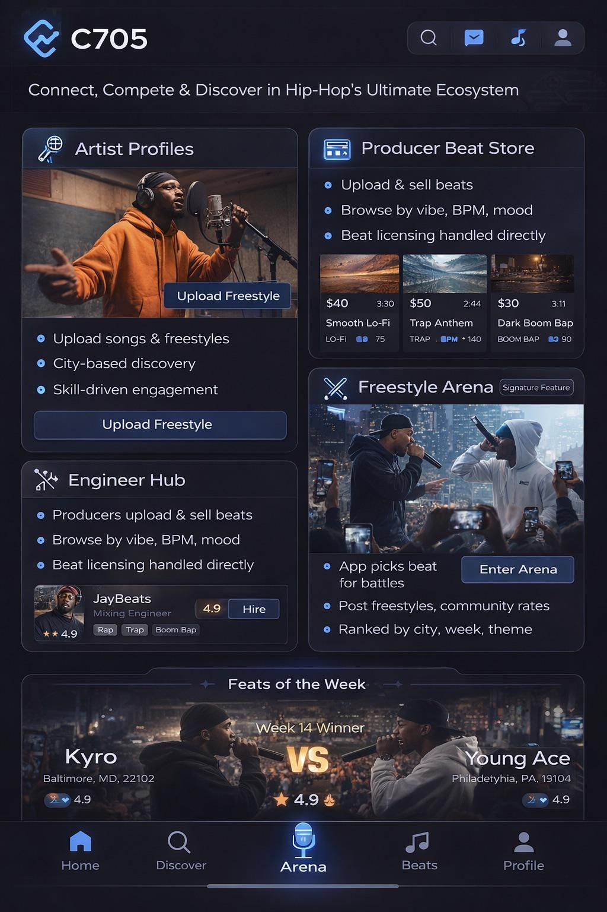

# Cypher App Design Reference

This mockup is the visual target for the app. (The logo reads "C705" in the
image; treat that as a placeholder for Cypher.)

**Tagline:** Connect, Compete & Discover in Hip-Hop's Ultimate Ecosystem

## Look and feel

- Dark navy / near-black backgrounds
- Electric blue accents, with a soft glow on active elements
- Rounded cards with subtle borders
- Bullet lists with small blue dots

## Layout

1. **Header:** logo plus four icons (search, messages, music, profile)
2. **Card grid (2 columns):**
   - Artist Profiles: photo, bullet list, "Upload Freestyle" button
   - Producer Beat Store: bullet list plus beat tiles (price, length, title, genre, BPM)
   - Engineer Hub: bullet list plus an engineer row (name, rating, "Hire" button)
   - Freestyle Arena (tagged "Signature Feature"): photo, bullets, "Enter Arena" button
3. **Feats of the Week banner:** Week 14 winner, Kyro vs Young Ace, with city, zip code, and rating
4. **Bottom tab bar:** Home, Discover, **Arena** (center, highlighted mic icon), Beats, Profile

## Build order (suggested)

1. Design tokens (colors, spacing, radius as CSS variables)
2. Bottom tab bar
3. Header
4. Cards, then the battle banner